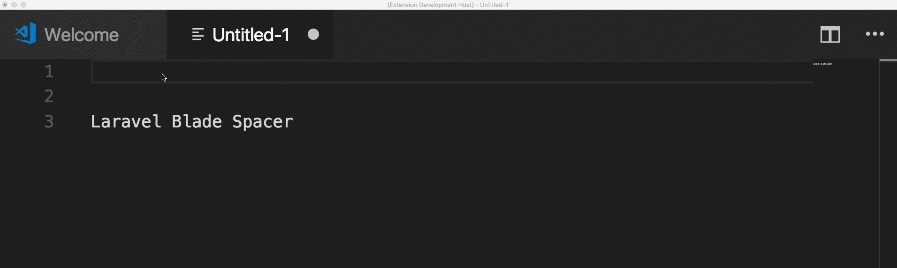

# laravel-blade-spacer

A VSCode extension to automatically space blade templating markers. 
For example, typing `{{}}` would automatically make `{{ | }}`.

## Features

Currently only `{{` and `{!!` tags are supported, but pull requests are always welcome!

## Known Issues
> **Warning!**  Currently only the regular `{{` tag works with selections

## Release Notes

Users appreciate release notes as you update your extension.

### 0.1.0
Initial version supporting `{{` and `{!!` tags